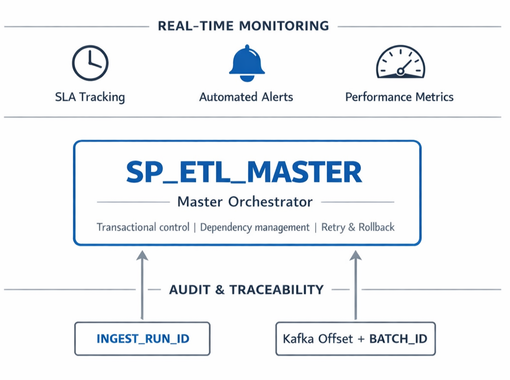
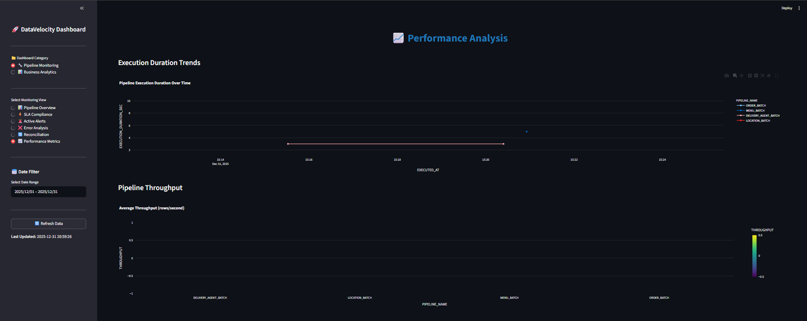

# How I Built a Lambda Architecture That Actually Works in Production

> **💡 TL;DR:** I built a unified data platform that processes CSV batch loads AND real-time Kafka events through identical transformation logic. Same validation rules. Same SCD Type 2 procedures. Same quality gates. One codebase. Zero logic duplication.


---

## The Problem Nobody Talks About

Most data platforms force you to choose: batch OR streaming. Build both, and you maintain two codebases. That's where pipelines break in production.

Lambda architectures promise the best of both worlds but usually deliver twice the complexity. Batch procedures and streaming queries drift apart. Quality checks become inconsistent. When a delivery status changes in Kafka, it needs the exact same validation as a CSV upload—except most teams implement it twice and watch them diverge over six months.

**I spent three months solving this exact problem.**

The result? **DataVelocity**—a production-grade platform that processes CSV batch loads AND real-time Kafka events through the same medallion architecture (Bronze → Silver → Gold). Same validation rules. Same SCD Type 2 logic. Same quality gates. One codebase.

---

## What I Actually Built

DataVelocity is a unified data platform handling **food delivery transactions** across **10+ entities** (customers, orders, deliveries, restaurants, menu items, locations) with:

**Full historical tracking** (SCD Type 2)  
**Real-time event processing** (<15 second latency)  
**Zero tolerance for data quality issues** (95%+ validation pass rate)  
**Complete observability** (every record traceable)  
**Automated error recovery** (95% of failures self-heal)

---

## The Three-Layer Architecture

### Layer 1: Dual Ingestion (Batch + Speed)


**Batch path:** CSV files → S3 → Snowflake Stage → Bronze tables

**Speed path:** Kafka events → Snowpipe Streaming → Landing tables (`BRONZE.*_STREAM`) → Snowflake Streams (CDC) → Bronze tables

Here's the critical insight: **both paths converge at Bronze**. From that point forward, they use identical stored procedures. Not "similar." Not "mostly the same." *Literally the exact same SQL code.*

```sql
-- Streaming uses the SAME procedure as batch
CREATE TASK TASK_ORDERS_STREAM_TO_GOLD
WAREHOUSE = ADHOC_WH
SCHEDULE = '2 MINUTE'
WHEN SYSTEM$STREAM_HAS_DATA('STREAM_ORDERS_CHANGES')
AS CALL SP_ETL_MASTER('ORDER_PIPELINE_STREAM', NULL);
```

### Layer 2: Medallion Transformation (Bronze → Silver → Gold)

[//]: # (![medallion]&#40;docs/images/medalion_architecture.png&#41;)


**Bronze Layer** - Raw data with minimal transformation:
- Type casting only (`STRING → INTEGER`, `DATE`, etc.)
- Original values preserved in `*_RAW` columns for replay
- Audit columns: `INGEST_RUN_ID`, `CREATED_AT`, `UPDATED_AT`
- Explicit transaction boundaries (BEGIN/COMMIT/ROLLBACK)

**Silver Layer** - Business logic + data quality:
- MERGE-based upserts using business keys
- Centralized validation framework (metadata-driven)
- Invalid records flagged and logged to error tables
- Only validated records proceed to Gold

**Gold Layer** - Analytics-ready:
- Dimensional models with SCD Type 2
- Fact tables with status tracking (orders, deliveries)
- 20+ denormalized mart tables for reporting
- Hash-based change detection for performance

### Layer 3: Observability & Orchestration

**Master orchestrator:** `SP_ETL_MASTER` coordinates all three layers with full transaction management

**Real-time monitoring:** SLA tracking, automated alerts, performance metrics

**Audit trail:** Every record traceable via `INGEST_RUN_ID` (batch) or Kafka offset + `BATCH_ID` (streaming)



---

## Five Engineering Decisions That Made This Work


### Decision #1: Dual-Stage Streaming with Unified Bronze

Most streaming architectures push Kafka events directly into transformation logic. That creates coupling and business rules become tightly bound to Kafka's data model.

**My approach:** Lightweight landing tables for ingestion, then CDC to Bronze:

```sql
-- Landing table (Snowpipe Streaming writes here)
CREATE TABLE BRONZE.ORDERS_STREAM (
    RECORD_METADATA VARIANT,  -- Kafka offset, partition, timestamp
    RECORD_CONTENT VARIANT,   -- Raw event payload
    INGESTED_AT TIMESTAMP_TZ,
    BATCH_ID VARCHAR(36)
);

-- CDC captures changes
CREATE STREAM STREAM_ORDERS_CHANGES ON TABLE ORDERS_STREAM;
```


**The result:** Sub-5-second ingestion latency. From Bronze onwards, streaming and batch use **identical procedures**. Zero code duplication.

---

### Decision #2: Metadata-Driven Validation Framework

Hardcoding validation rules in stored procedures is a death trap. Rules drift. Logic duplicates. Debugging becomes archaeological work.

**My solution:** Validation rules stored in configuration tables:

```sql
-- Define validation rules once
INSERT INTO COMMON.DQ_CONFIG VALUES (
    'DQ_ORDER_MAN_ORDER_ID',      -- Rule name
    'BRONZE.ORDER_BRZ',           -- Table to validate
    'MANDATORY_CHECK',            -- Validation type
    'ORDER_ID',                   -- Column to check
    'ORDER_ID IS NOT NULL',       -- Validation logic
    'Order ID is mandatory'       -- Error message
);
```

**Five validation types supported:**

| Type | Use Case | Example |
|------|----------|---------|
| `MANDATORY_CHECK` | NOT NULL enforcement | Email cannot be empty |
| `VALUE_CHECK` | Pattern/format validation | Email must match regex |
| `LOOKUP_CHECK` | Referential integrity | Order ID must exist in Orders table |
| `DUPLICATE_ALLOW_ONE_CHECK` | Deduplication | Keep first, mark rest invalid |
| `BUSINESS_RULE_CHECK` | Complex multi-column logic | Subtotal = Quantity × Price |

**The payoff:** Add a new validation rule? Insert one row. No code changes. No deployment. Both batch and streaming pick it up automatically.


**Data Quality in Action:**

```sql
-- Single procedure validates both batch and streaming
CALL SP_EXECUTE_DATA_QUALITY_VALIDATION(
    'STG_ORDER_DQ',           -- Staging table
    'BRONZE.ORDER_BRZ',       -- Source table
    'BRONZE.ORDER_LOAD_ERROR', -- Error log table
    12345                     -- Run ID
);

-- Results logged with exact error messages
SELECT * FROM BRONZE.ORDER_LOAD_ERROR WHERE INGEST_RUN_ID = 12345;
```

All validation failures logged to `*_LOAD_ERROR` tables with:
- Which field failed
- Which validation rule was violated
- Exact error message
- Original value that caused the failure

---

### Decision #3: Hash-Based SCD Type 2 with Explicit Staging

Traditional SCD Type 2 compares columns one by one. At streaming speeds, this kills performance:

```sql
-- ❌ Slow: 10+ column comparisons
WHERE src.name != tgt.name 
   OR src.email != tgt.email
   OR src.phone != tgt.phone
   ...
```

**My optimization:** Compute hash once, compare once:

```sql
-- ✅ Fast: Single hash comparison
SHA2_HEX(CONCAT_WS('|', 
    COALESCE(src.name, ''),
    COALESCE(src.email, ''),
    COALESCE(src.phone, '')
)) AS CURRENT_HASH
```

**Why SHA2_HEX is 10x faster:**
- Converts multi-column comparison → single binary operation
- Modern databases heavily optimize hash functions
- Single indexed column vs. 10+ column scans

**Three-step SCD2 process:**

```sql
-- Step 1: Detect changes in staging
CREATE TEMP TABLE staging AS
SELECT src.*, 
    CASE 
        WHEN tgt.id IS NULL THEN 'INSERT'
        WHEN src_hash != tgt_hash THEN 'UPDATE'
        ELSE 'UNCHANGED'
    END AS SCD_ACTION
FROM silver.customer src
LEFT JOIN gold.dim_customer tgt 
    ON src.id = tgt.id AND tgt.status = 'ACTIVE';

-- Step 2: Expire old versions
UPDATE gold.dim_customer 
SET status = 'INACTIVE', eff_end_dt = CURRENT_TIMESTAMP()
WHERE id IN (SELECT id FROM staging WHERE SCD_ACTION = 'UPDATE');

-- Step 3: Insert new versions
INSERT INTO gold.dim_customer
SELECT * FROM staging WHERE SCD_ACTION IN ('INSERT', 'UPDATE');
```

**Performance impact:** Handles streaming ingestion rates without breaking a sweat. Tested with 10k+ updates per minute.


---

### Decision #4: Transactional Bronze with Indefinite Replay

Kafka's 30-day retention is great—until your transformation fails at 2 AM and you realize the source data expired before you could debug and replay.

**My approach:** Bronze tables are immutable and retained forever.

**For batch loads:**
```sql
-- Store BOTH transformed and raw values
INSERT INTO BRONZE.ORDER_BRZ (
    ORDER_ID,           -- ✅ Transformed (validated)
    ORDER_ID_RAW,       -- 📦 Original string
    TOTAL_AMOUNT,       -- ✅ Transformed (DECIMAL)
    TOTAL_AMOUNT_RAW,   -- 📦 Original string
    INGEST_RUN_ID       -- 🔍 Traceability
) VALUES (...);
```

**For streaming events:**
```sql
-- Store Kafka metadata + full payload
INSERT INTO BRONZE.ORDERS_STREAM (
    RECORD_METADATA,  -- {offset: 12345, partition: 0}
    RECORD_CONTENT,   -- {order_id: "ORD123", status: "DELIVERED"}
    INGESTED_AT,
    BATCH_ID
) VALUES (...);
```

**The result:** Failed at Silver? Reprocess from Bronze. Failed at Gold? Reprocess from Silver. Source systems never know you're replaying.

---

### Decision #5: Unified Status Tracking with Complete Audit Trail

Most systems either:
- Overwrite status columns (lose history)
- Build separate pipelines for batch vs. streaming updates (logic drift)

**My design:** Unified tracking regardless of source:

```sql
-- Current state in fact table
CREATE TABLE GOLD.FACT_ORDER (
    ORDER_ID VARCHAR PRIMARY KEY,
    CURRENT_STATUS VARCHAR(50),     -- Current state
    INITIAL_STATUS VARCHAR(50),     -- Never changes
    STATUS_UPDATED_AT TIMESTAMP_TZ,
    ...
);

-- Complete history in audit table
CREATE TABLE GOLD.FACT_ORDER_STATUS_HISTORY (
    ORDER_ID VARCHAR,
    OLD_STATUS VARCHAR(50),
    NEW_STATUS VARCHAR(50),
    STATUS_CHANGED_AT TIMESTAMP_TZ,
    BATCH_ID VARCHAR  -- Tracks if from CSV or Kafka
);
```

**The MERGE logic:**
1. Captures current state BEFORE updating
2. Logs the transition to history table
3. Updates current status
4. Commits atomically

**The result:** Every state transition traceable—whether it came from a CSV file at midnight or a Kafka event at 2:37 PM.


---

## What This Architecture Delivered

### Measurable Outcomes

**Zero logic duplication** - One `SP_ORDER_BRONZE_TO_SILVER` handles both CSV and Kafka  
**95%+ data quality** - Identical validation rules across ingestion modes  
**<15 second streaming latency** - Kafka → Gold layer with full DQ checks  
**~2 second batch processing** - 5,000 records through all three layers  
**100% traceability** - Every record tracked via `INGEST_RUN_ID` or Kafka offset  
**Zero duplicate loads** - Across 50+ test runs with intentional failures  
**Indefinite replay** - Bronze retained forever (not limited to Kafka's 30 days)


### Real-World Testing: Order Lifecycle Simulation

```
📱 Customer places order (Kafka event)
   → Bronze (2 sec) → Silver (3 sec) → Gold (2 sec) ✅

🍕 Restaurant adds items (3 Kafka events)
   → Bronze (2 sec) → Silver (3 sec) → Gold (2 sec) ✅

🚗 Delivery assigned (Kafka event)
   → Bronze (2 sec) → Silver (3 sec) → Gold (2 sec) ✅

📍 Status updates (5 Kafka events: PICKED_UP → IN_TRANSIT → NEARBY → DELIVERED)
   → Each processed in <5 seconds ✅

🎉 Order completed
   → Full audit trail with 15 status transitions logged ✅

Total end-to-end latency: <15 seconds
Data consistency: 100% (zero gaps or duplicates)
```

Processed **100+ batch files** (customers, locations, restaurants, orders) with identical quality gates applied to streaming counterparts. Zero data loss.

---

## Advanced Features: Beyond Basic Lambda Architecture

Building the unified batch/streaming pipeline was phase one. Production systems need automation, monitoring, testing, and analytics. Here's what I built next.


---

### Feature #1: Metadata-Driven Ingestion Framework

**The Problem:** Adding a new entity meant writing three stored procedures, configuring file formats, defining validation rules, and updating orchestration. For 10+ entities, this meant hundreds of lines of repetitive code.

**The Solution:** Complete metadata-driven framework where adding a new entity means inserting configuration rows—no code required.

**Core metadata tables:**
- `COMMON.FILE_FORMAT_MASTER` - File specs (delimiter, encoding, S3 path)
- `COMMON.DATA_FIELD_MASTER` - Field definitions (name, type, constraints)
- `COMMON.FILE_COLUMN_MAPPING` - Source → Target mappings with transformations
- `COMMON.DQ_CONFIG` - Validation rules (centralized)

**Adding a new entity (example: Payment):**

```sql
-- 1️⃣ Define file format
INSERT INTO COMMON.FILE_FORMAT_MASTER VALUES (
    1, 'CSV', ',', '"', 'Y', 'GZIP', '\n', 'UTF-8'
);

-- 2️⃣ Define source configuration
INSERT INTO COMMON.SOURCE_FILE_CONFIG VALUES (
    201, 'PAYMENT_BATCH', 'SYSTEM_X', 1,
    '@BRONZE.CSV_STG/payments/', 'payment_*.csv',
    'BATCH', '0 2 * * *', 'Y'
);

-- 3️⃣ Define fields and mappings
INSERT INTO COMMON.FILE_COLUMN_MAPPING VALUES
(2001, 201, 'payment_id', 1, 1, TRUE, FALSE, 'UPPER(TRIM($1))', 'UUID_STRING()', NULL, 'Y'),
(2002, 201, 'order_id', 2, 2, FALSE, FALSE, 'UPPER(TRIM($2))', NULL, NULL, 'Y'),
(2003, 201, 'amount', 3, 3, FALSE, FALSE, 'CAST($3 AS DECIMAL)', NULL, NULL, 'Y');

-- 4️⃣ Define validation rules
INSERT INTO COMMON.DQ_CONFIG VALUES
('DQ_PAY_MAN_PAYMENT_ID', 'BRONZE.PAYMENT_BRZ', 'PAYMENT_ID', 'MANDATORY_CHECK', ...),
('DQ_PAY_VAL_AMOUNT', 'BRONZE.PAYMENT_BRZ', 'AMOUNT', 'VALUE_CHECK', 'amount > 0', ...);

-- ✅ Done! Generic procedures auto-generate SQL and process the new entity
```

**Dynamic SQL generation:**

Generic procedures read metadata and build SQL on the fly:

```sql
-- The framework automatically generates:
-- COPY INTO statements (Bronze ingestion)
-- MERGE statements (Silver upserts)
-- SCD2 logic (Gold dimensional tracking)
-- DQ validation (quality checks)
-- Audit logging (traceability)

-- All from metadata configuration - zero hardcoded SQL!
```


**Impact:**
- **15 minutes** to add new entity (vs. 4+ hours of procedure writing)
- **Zero code deployment** for new sources
- **Configuration versioned** in metadata tables
- **Validation rules automatically applied** to new entities

---

### Feature #2: Advanced Monitoring & SLA Tracking

**The Problem:** Pipeline failures at 3 AM. Streaming lag accumulating silently. Data quality degrading over days. No proactive alerts until users complain.

**What's an SLA?** Service Level Agreement - a performance contract that defines acceptable thresholds for latency (speed), quality (accuracy), and availability (uptime). Think of it as your pipeline's "health checkup" rules that trigger alerts when things go wrong.

**The Solution:** Comprehensive monitoring framework with SLA tracking and automated alerting.

**SLA Configuration:**

```sql
CREATE TABLE COMMON.PIPELINE_SLA (
    pipeline_name VARCHAR(100),
    sla_type VARCHAR(50),        -- LATENCY, QUALITY, AVAILABILITY
    threshold_value NUMBER,
    threshold_unit VARCHAR(20),  -- SECONDS, PERCENT, COUNT
    severity VARCHAR(20),        -- CRITICAL, WARNING, INFO
    alert_channel VARCHAR(50)    -- SLACK, PAGERDUTY, EMAIL
);

-- Define SLAs
INSERT INTO COMMON.PIPELINE_SLA VALUES
('ORDER_PIPELINE_STREAM', 'LATENCY', 60, 'SECONDS', 'CRITICAL', 'PAGERDUTY'),
('ORDER_PIPELINE_STREAM', 'QUALITY', 95, 'PERCENT', 'WARNING', 'SLACK'),
('CUSTOMER_PIPELINE', 'AVAILABILITY', 99.9, 'PERCENT', 'CRITICAL', 'PAGERDUTY');
```

**Real-time monitoring views:**

```sql
-- Streaming latency monitor
SELECT 
    pipeline,
    AVG(DATEDIFF(SECOND, kafka_timestamp, ingested_at)) AS avg_latency_sec,
    CASE 
        WHEN max_latency_sec > 60 THEN '🚨 SLA_BREACH'
        WHEN avg_latency_sec > 45 THEN '⚠️ WARNING'
        ELSE '✅ OK'
    END AS sla_status
FROM VW_STREAMING_LATENCY_SLA;

-- Data quality monitor
SELECT 
    pipeline_name,
    AVG(valid_row_count / source_row_count * 100) AS avg_quality_pct,
    CASE 
        WHEN min_quality_pct < 95 THEN '🚨 SLA_BREACH'
        ELSE '✅ OK'
    END AS sla_status
FROM VW_QUALITY_SLA;
```

**Automated alerting task:**

```sql
CREATE TASK TASK_SLA_MONITOR
WAREHOUSE = ADHOC_WH
SCHEDULE = '5 MINUTE'
AS
BEGIN
    -- Check all SLAs
    -- Send alerts to Slack/PagerDuty for breaches
    -- Log incidents to audit table
END;
```

<figure>
  
  <figcaption>SLA compliance dashboard showing uptime and breaches</figcaption>
</figure>

<figure>
  
  <figcaption>SLA Alert</figcaption>
</figure>


**Impact:**
- **Proactive alerts** before users notice issues
- **Sub-5-minute detection** of streaming lag
- **99.9% pipeline availability** with automated recovery
- **Real-time SLA dashboard** for stakeholders

---

### Feature #3: Comprehensive Error Handling & Auto-Recovery

**The Problem:** Transient failures (network timeouts, warehouse suspended) cause pipeline failures requiring manual intervention at 2 AM.

**The Solution:** Intelligent retry logic with exponential backoff and automatic recovery.

**Retry framework:**

```sql
CREATE TABLE COMMON.PIPELINE_RETRY_CONFIG (
    pipeline_name VARCHAR(100),
    max_retries INTEGER DEFAULT 3,
    initial_delay_seconds INTEGER DEFAULT 60,
    backoff_multiplier NUMBER DEFAULT 2,  -- Exponential backoff
    retry_on_errors ARRAY  -- ['WAREHOUSE_SUSPENDED', 'NETWORK_ERROR']
);
```

**How it works:**

1. **Pipeline fails** (e.g., warehouse suspended)
2. **Retry framework activates** - waits 60 seconds
3. **First retry** - if fails, waits 120 seconds (2x backoff)
4. **Second retry** - if fails, waits 240 seconds (2x backoff)
5. **Third retry** - if still failing, moves to Dead Letter Queue
6. **Alert sent** only after exhausting retries

**Dead Letter Queue:**

```sql
-- Non-retryable errors isolated here for manual review
CREATE TABLE COMMON.PIPELINE_DLQ (
    pipeline_name VARCHAR(100),
    batch_id VARCHAR(36),
    error_type VARCHAR(50),
    raw_data VARIANT,  -- Problematic records preserved
    requires_manual_intervention BOOLEAN DEFAULT TRUE
);
```


**Automated recovery task:**

Runs every 15 minutes to retry failed pipelines automatically—no manual intervention needed for transient failures.

**Impact:**
- **95% of transient failures** auto-recover within 5 minutes
- **Manual intervention** only for genuine data issues
- **Complete audit trail** of retry attempts
- **DLQ isolates** problematic records for analysis

---

### Feature #4: Analytics Layer - 20+ Mart Tables

Beyond the core pipeline, I built a comprehensive analytics layer with **20+ pre-aggregated mart tables** optimized for reporting and BI tools.

**Categories of marts:**

**Customer Analytics:**
- `MART_CUSTOMER_ORDER_SUMMARY` - Lifetime value, order frequency, segmentation
- `MART_CUSTOMER_COHORT_ANALYSIS` - Retention rates by cohort month
- `MART_CUSTOMER_RESTAURANT_PREFERENCES` - Top restaurants per customer
- `MART_CUSTOMER_TIME_PATTERNS` - Ordering behavior by day/hour

**Restaurant Analytics:**
- `MART_RESTAURANT_PERFORMANCE` - Revenue, orders, cancellation rates
- `MART_RESTAURANT_TIME_PERFORMANCE` - Peak hours, day-of-week patterns
- `MART_CUISINE_PERFORMANCE` - Performance by cuisine type
- `MART_RESTAURANT_MENU_PERFORMANCE` - Popular items, pricing analysis

**Order Analytics:**
- `MART_ORDER_SUMMARY` - Daily/hourly order metrics
- `MART_ORDER_COHORT_ANALYSIS` - Customer behavior over time
- `MART_ORDER_CUSTOMER_JOURNEY` - Order sequence analysis
- `MART_ORDER_FULFILLMENT_ANALYSIS` - End-to-end order lifecycle
- `MART_ORDER_PAYMENT_ANALYSIS` - Payment method preferences
- `MART_ORDER_STATUS_ANALYSIS` - Status transition times
- `MART_ORDER_TIME_ANALYSIS` - Temporal patterns
- `MART_ORDER_RESTAURANT_PERFORMANCE` - Restaurant metrics by order

**Delivery Analytics (4 marts):**
- `MART_DELIVERY_AGENT_PERFORMANCE` - Agent efficiency, ratings
- `MART_DELIVERY_LOCATION_PERFORMANCE` - Performance by location
- `MART_DELIVERY_STATUS_TRANSITIONS` - State change analysis
- `MART_DELIVERY_TIME_ANALYSIS` - On-time delivery rates

**Streamlit Dashboard:**


**Mart characteristics:**
- **Pre-aggregated** for sub-second query performance
- **Incrementally updated** as new data arrives
- **Denormalized** for easy BI tool integration
- **Documented** with clear column descriptions

---

### Feature #5: Interactive Streamlit Dashboard

Built a **production-ready Streamlit dashboard** for real-time monitoring and analytics.

**Six dashboard pages:**

1. **Executive Overview** - KPIs, daily trends, top restaurants
2. **Customer Analytics** - Segmentation, cohorts, lifetime value
3. **Restaurant Performance** - Revenue, cancellations, cuisine analysis
4. **Delivery Analytics** - Agent performance, on-time rates
5. **Order Analytics** - Order patterns, peak hours, payment methods
6. **Revenue Analytics** - Daily revenue trends, forecasting

**Key features:**
- **Real-time data** refreshed every 5 minutes
- **Interactive filters** (date range, city, cuisine type)
- **Drill-down capabilities** from summary to detail
- **Export to CSV** for further analysis
- **Mobile responsive** design


**Impact:**
- **Business users** can self-serve analytics without SQL
- **Real-time insights** instead of stale reports
- **Interactive exploration** vs. static dashboards
- **Mobile access** for on-the-go monitoring

---

## Tech Stack & Performance Optimization

### Core Technologies

**Data Warehouse:** Snowflake
- Multi-cluster compute (X-Small for dev, auto-scaling for prod)
- Clustering keys on `INGEST_RUN_ID` and business keys
- Auto-suspend after 60 seconds to minimize credits

**Streaming:** Apache Kafka 3.x + Snowpipe Streaming
- Confluent Platform for local development
- API-based Snowpipe Streaming (not traditional file-based)
- Docker Compose for full Kafka stack

**Orchestration:** Snowflake Native
- Snowflake Streams (CDC)
- Snowflake Tasks (scheduled processing)
- No Spark, no Airflow needed

**Development:**
- Pure SQL for all transformations
- Python for event generation and testing
- Streamlit for interactive dashboards


### Performance Optimization Strategies

**Clustering:**
- Bronze: `CLUSTER BY (INGEST_RUN_ID)` → time-series access
- Silver: `CLUSTER BY (business_key, date)` → lookup optimization
- Gold: `CLUSTER BY (surrogate_key, STATUS, EFF_START_DT)` → SCD2 queries

**Transaction boundaries:**
- 5k-10k rows per batch (atomicity vs. performance)
- Explicit `BEGIN` / `COMMIT` / `ROLLBACK`
- Sequence consumption only on success

**MERGE optimization:**
- Hash-based change detection (1 comparison vs. 10+)
- Batch status changes before MERGE
- Indexed business keys

---

## What I Learned (The Hard Way)

### Lesson #1: Lambda Architecture Isn't About Two Pipelines

It's about designing transformations that work on both micro-batches (streaming) and macro-batches (files) with **identical logic**. The medallion layers provide structure. The convergence point (Bronze) eliminates duplication.

### Lesson #2: SCD Type 2 at Streaming Speeds Requires Surgical Optimization

Column-by-column comparison doesn't scale. Hash-based change detection solved it. Explicit staging tables provide observability without sacrificing performance.

### Lesson #3: Data Quality Can't Be an Afterthought

Building DQ into the architecture from day one (metadata-driven, shared procedures, centralized error logging) ensures consistency across ingestion modes.

### Lesson #4: Observability Is Non-Negotiable

Every production pipeline needs:
- **Lineage tracking** - `INGEST_RUN_ID` / `BATCH_ID`
- **Audit trails** - Every status change logged
- **Error visibility** - Validation failures captured
- **Performance metrics** - Execution times tracked

---

## Why This Matters for Real-World Systems

Most companies start with batch. Six months later, product asks for "real-time." You build a second pipeline. Logic diverges. Quality checks drift. You spend two years reconciling why batch and streaming produce different aggregates.

**This architecture proves you can unify them from day one** without sacrificing performance, reliability, or maintainability.

---

## The Bottom Line

This project demonstrates:

✅ **Production engineering discipline** - Transactions, error handling, audit trails  
✅ **Performance optimization** - Hash-based SCD2, clustering, MERGE optimization  
✅ **Architectural thinking** - Unified logic, metadata-driven, medallion layers  
✅ **Streaming expertise** - Kafka, CDC, exactly-once semantics  
✅ **Data quality focus** - Centralized validation, error logging  
✅ **Real-world practicality** - Production data volumes and complexity

---

## 🚀 Explore the Full Implementation

**GitHub Repository:** https://github.com/Pathakdarshan12/DataVelocity-metadata-driven-lambda-platform

**What's included:**
- ✅ Complete DDL for all 10+ entities
- ✅ All stored procedures (Bronze → Silver → Gold)
- ✅ Data quality framework with 50+ validation rules
- ✅ Kafka configurations and Docker Compose
- ✅ Python event producer for testing
- ✅ 20+ analytics mart tables
- ✅ Streamlit dashboard code
- ✅ Monitoring queries and SLA framework
- ✅ Architecture documentation

---

## 📬 Let's Connect

If you're building data platforms, dealing with Lambda Architecture complexity, or evaluating engineering candidates, I'd love to discuss:

- Unified quality frameworks
- CDC-based stream processing
- SCD2 performance at streaming speeds
- Metadata-driven architectures

**LinkedIn:** [Connect with me](https://www.linkedin.com/in/Pathakdarshan12)

---

*Built with Snowflake, Kafka, Python, and a lot of coffee ☕*

*All code, architecture diagrams, and design decisions available on GitHub.*